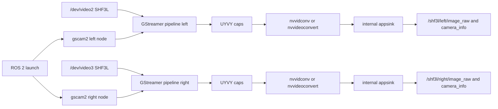

# SHF3L Dual-Camera ROS GStreamer Bridge Plan

## Recommendation

Use `gscam2` as the primary ROS 2 camera integration, because the project intends to run and orchestrate cameras in ROS. In this shape, ROS launch starts two camera nodes, each node owns one GStreamer pipeline, and GStreamer remains the internal capture/conversion backend rather than becoming the external product interface.

Build `clydemcqueen/gscam2` from source for v1. It has the job shape we want: parse a GStreamer pipeline, attach an internal `appsink`, publish `sensor_msgs/msg/Image`, publish `CameraInfo`, and expose ROS parameters for `gscam_config`, `camera_info_url`, `camera_name`, `frame_id`, `use_gst_timestamps`, and `image_encoding`. It is also compact, supports ROS 2 composition/intra-process examples, and is easier to inspect or fork if we need a small SHF3L-specific adjustment.

Do not build a new ROS sink plugin for v1. A sink plugin is useful when GStreamer is the orchestration surface, but that would create a different product from the ROS-operated camera driver we actually want.

## Bridge Evaluation

- `clydemcqueen/gscam2`: primary v1 target. It is a ROS 2 node, not a sink plugin. It uses an internal `appsink`, publishes `image_raw` and `camera_info`, supports ROS 2 composition/intra-process examples, and has a straightforward `gscam_main` executable and parameter surface.
- `ros-drivers/gscam`: no longer the preferred target for this Jetson host. It is released for ROS 2 Jazzy and follows the expected ROS camera driver model, but installing binary `ros-jazzy-gscam` on the host currently pulls Ubuntu OpenCV dev packages that would downgrade NVIDIA OpenCV and remove JetPack metapackages. Keep it as a reference only unless Docker validation proves it is already available without disturbing JetPack.
- `StefanFabian/gstreamer_ros_babel_fish`: good true GStreamer sink plugin, but no longer the preferred primary path because we intend ROS to orchestrate the system. Keep it as a fallback if `gst-launch`-native operation later becomes important.
- `BrettRD/ros-gst-bridge`: true GStreamer plugin design, but its docs list `rosimagesink needs a CameraInfo publisher` as future work, so it is not a good fit for this monocular camera requirement.

## Target Data Flow



## Assumptions

- ROS 2 Jazzy on Jetson Thor is the target unless the project later proves otherwise.
- `/dev/video2` and `/dev/video3` are the SHF3L `sgx-yuv-gmsl2` nodes and should be run in parallel.
- `nvarguscamerasrc` and V4L2 use different identifiers for the available cameras: Argus supports `sensor-id=0` and `sensor-id=1`; the V4L2 SHF3L path supports `/dev/video2` and `/dev/video3`.
- Prefer forcing `UYVY` caps first because the known camera nodes expose `UYVY`/`NV16`, and `UYVY` is a clearer fit for GStreamer/ROS encoding support.
- NVIDIA `nvvidconv` or DeepStream `nvvideoconvert` should be validated before any custom VPI transform is considered.
- The final ROS image topic must publish `sensor_msgs/msg/Image` with `rgb8` encoding. Raw YUV, `rgba8`, and `bgrx` are acceptable only as internal/debug formats, not as the final v1 camera output.
- `nvvidconv` on the target does not output packed 3-byte `RGB`; it outputs `RGBA` or `BGRx`. Because final output must be `rgb8`, the validated v1 pipeline uses a small CPU `videoconvert` tail from `RGBA` to `RGB` after NVIDIA hardware conversion.

## Validation Findings

- Target host: `sh-01` was reached at `192.168.31.225`; it reports Jetson Linux `R38.4.0` on aarch64, matching the JetPack 7.x / Thor target.
- Host-level ROS was not initially installed under `/opt/ros`, and `ros2` was not initially on `PATH`; ROS validation started through Isaac ROS environment activation, with local Jazzy now being prepared as a fallback.
- `isaac-ros-cli` was built from `~/dev/isaac/scripts/isaac-ros-cli`, installed as `isaac-ros-cli 2.3.0-1`, initialized with `sudo isaac-ros init docker --yes`, and reports `mode: docker`, `activation: inactive`.
- `isaac-ros activate --build-local` requires `ISAAC_ROS_WS=/home/unitree/dev/isaac` in the current non-interactive shell. With that variable set, activation reached prerequisite checks; `git-lfs` is installed now.
- The ROS 2 Jazzy apt repository was added on Ubuntu 24.04 / Noble. `ros-jazzy-ros-base`, `ros-jazzy-camera-info-manager`, `ros-jazzy-image-transport`, `ros-jazzy-gscam`, and `ros-jazzy-usb-cam` are available for arm64.
- Host binary `ros-jazzy-gscam` and `ros-jazzy-usb-cam` are not safe to install as-is on this Jetson image: apt simulation showed they would downgrade NVIDIA `libopencv-dev` from `4.8.0-3-g6ef37b4` to Ubuntu `4.6.0` and remove `nvidia-jetpack`, `nvidia-jetpack-dev`, and `nvidia-opencv-dev`. Source-build `gscam2` against the existing JetPack stack instead.
- Local ROS 2 Jazzy dependencies were installed without OpenCV/JetPack downgrades, and `gscam2` was built from `/home/unitree/dev/gscam2` in `/home/unitree/dev/shf3l_ros_ws`.
- Local `gscam2` validation passed with `videotestsrc`: `rgb8` Image plus CameraInfo when a calibration YAML is provided.
- Real `/dev/video2` validation through local `gscam2` passed with the V4L2 SHF3L pipeline: `rgb8`, `1280x720`, `step=3840`, and CameraInfo `1280x720`.
- A separate-process Argus `gscam2` path was added under `scripts/run_gscam2_argus_*.sh`; initial validation passed with the supported Argus cameras `sensor-id=0` and `sensor-id=1`. The current launch default publishes downsampled `rgb8` `640x480` Image and matching CameraInfo for both processes.
- The V4L2 pipeline supports `/dev/video2` and `/dev/video3`; Argus supports `sensor-id=0` and `sensor-id=1`. These are backend-specific identifiers and should not be mixed.
- RViz2 is installed at `/opt/ros/jazzy/bin/rviz2`.
- `/dev/video2` and `/dev/video3` exist and both advertise `UYVY` and `NV16` at 1280x720, 1920x1536, 2880x1860, 3840x2160, and 1600x1300 at 30 fps.
- GStreamer `1.24.2` is installed on the host.
- `nvvidconv` is installed; `nvvideoconvert` is not installed.
- `nvvidconv` accepts raw `UYVY` and `NV16` input and can output `RGBA`, `BGRx`, `UYVY`, and `NV16`. `RGBA`/`BGRx` are intermediate formats only; the final ROS output requirement is `rgb8`.
- `nvvidconv` does not negotiate output caps for `RGB`, `BGR`, `RGBx`, `xRGB`, `xBGR`, `BGRA`, `ARGB`, or `ABGR` on this target.
- Real camera smoke tests passed for `/dev/video2` and `/dev/video3`: each can stream `UYVY 1280x720@30` through `nvvidconv` to `RGBA`.
- A dual-camera smoke test passed with both `/dev/video2` and `/dev/video3` streaming concurrently through `nvvidconv` to `RGBA`.
- A fallback pipeline `UYVY -> nvvidconv -> RGBA -> videoconvert -> RGB` passed, so strict `rgb8` remains possible with only the RGBA-to-RGB tail on CPU.

## Proposed Output Structure

- `src/shf3l_camera_bringup/`: ROS 2 package containing launch files, pipeline configs, calibration YAMLs, and bring-up docs.
- `src/gscam2/`: source checkout of `clydemcqueen/gscam2` unless the active Isaac ROS environment already provides it.
- `scripts/run_gscam2_argus_*.sh`: separate-process Argus camera runners for `gscam2`.
- `config/calibration/`: placeholder CameraInfo YAMLs for Argus validation.
- `docs/`: bring-up notes, troubleshooting, and pipeline examples.

## Implementation Units

- U1. **Validate ROS camera node dependency**

  Goal: Build and validate `clydemcqueen/gscam2` as the SHF3L ROS camera node, including its GStreamer pipeline parameter, CameraInfo publication, launch orchestration, and ROS 2 Jazzy compatibility.

  Files: workspace dependency manifest, `src/shf3l_camera_bringup/README.md`, package dependency docs.

  Verification: a `videotestsrc` GStreamer pipeline launched through `ros2 run gscam2 gscam_main` publishes `image_raw` and `camera_info`; calibration loading and `set_camera_info` behavior match ROS camera expectations.

- U2. **Validate NVIDIA accelerated conversion**

  Goal: Use pre-existing NVIDIA GStreamer conversion first. `nvvidconv` is the available converter on the target; DeepStream `nvvideoconvert` is not installed. The validated accelerated output formats for SHF3L `UYVY`/`NV16` are `RGBA` and `BGRx`, not packed `RGB`, so v1 uses `nvvidconv` to `RGBA` followed by `videoconvert` to `RGB` for final `rgb8`.

  Files: `src/shf3l_camera_bringup/config/pipelines.yaml`, `src/shf3l_camera_bringup/README.md`, `docs/performance-notes.md`.

  Verification: caps negotiation succeeds for `UYVY -> RGBA`, `UYVY -> BGRx`, `NV16 -> RGBA`, and dual `/dev/video2` plus `/dev/video3` `UYVY -> RGBA` smoke tests. Remaining verification is ROS-side encoding choice and sustained load testing.

- U3. **Define two camera pipelines**

  Goal: Create launch/config entries for `/dev/video2` and `/dev/video3` that run concurrently as ROS-managed camera nodes, each with explicit V4L2 caps, queue isolation, NVIDIA conversion, topic remaps, frame IDs, and calibration URLs.

  Files: `src/shf3l_camera_bringup/launch/dual_shf3l.launch.py`, `src/shf3l_camera_bringup/config/pipelines.yaml`, calibration placeholders under `src/shf3l_camera_bringup/calibration/`.

  Verification: both ROS nodes start independently; failure in one camera does not block the other; topics publish under `/shf3l/left/*` and `/shf3l/right/*` with matching `frame_id` and CameraInfo timestamps.

- U4. **Add CameraInfo and calibration workflow**

  Goal: Provide per-camera calibration YAML locations and configure the chosen ROS camera node to publish CameraInfo with the same timestamp and frame ID as each image stream.

  Files: `src/shf3l_camera_bringup/calibration/left.yaml`, `src/shf3l_camera_bringup/calibration/right.yaml`, `src/shf3l_camera_bringup/README.md`.

  Verification: `camera_info` width/height matches the converted stream dimensions; `set_camera_info` works for each camera namespace if supported by the chosen node; mismatched calibration files fail visibly rather than publishing incorrect metadata.

- U5. **Hardware bring-up and performance validation**

  Goal: Validate the dual-camera ROS launch on Jetson Thor using real `/dev/video2` and `/dev/video3` nodes, confirming conversion backend, frame rate, timestamp behavior, and CPU/GPU load.

  Files: `docs/shf3l-bringup.md`, `docs/performance-notes.md`.

  Verification: both streams run in parallel for a sustained soak period; `ros2 topic hz` is stable; no repeated VI/GStreamer errors appear; selected NVIDIA conversion path and observed latency are recorded.

## Key Pipeline Shape

The intended runtime shape is two independent GStreamer pipelines owned by two `gscam2` ROS camera nodes and launched together by ROS:

```bash
export GSCAM_CONFIG="v4l2src device=/dev/video2 do-timestamp=true ! \
  video/x-raw,format=UYVY,width=1280,height=720,framerate=30/1 ! \
  queue leaky=downstream max-size-buffers=1 ! \
  nvvidconv ! video/x-raw,format=RGBA ! \
  videoconvert ! video/x-raw,format=RGB"

ros2 run gscam2 gscam_main --ros-args \
  -r /image_raw:=/shf3l/left/image_raw \
  -r /camera_info:=/shf3l/left/camera_info \
  -p camera_name:=shf3l_left \
  -p frame_id:=shf3l_left_optical_frame \
  -p camera_info_url:=package://shf3l_camera_bringup/calibration/left.yaml \
  -p image_encoding:=rgb8
```

The right pipeline mirrors this with `/dev/video3`, `/shf3l/right/image_raw`, and `right.yaml`.

The separate-process Argus path uses two `gscam2` processes:

```bash
cd /home/unitree/dev/sensing_wrist_gstreamer
./scripts/validate_gscam2_argus_dual.sh
```

Each process owns this pipeline shape:

```bash
nvarguscamerasrc sensor-id=<id> !
  video/x-raw(memory:NVMM),width=1920,height=1080,framerate=30/1 !
  nvvidconv ! video/x-raw,format=RGBA !
  videoconvert ! video/x-raw,format=RGB
```

Validated Argus IDs are `sensor-id=0` for `/shf3l/argus_left/*` and `sensor-id=1` for `/shf3l/argus_right/*`. The V4L2 path remains `/dev/video2` and `/dev/video3`.

Because final output must be `rgb8`, publishing `rgba8` is not a v1 option. A future optimization could replace the final CPU `videoconvert` tail with a custom NVIDIA/VPI/CUDA transform that emits packed RGB, but that should only be considered after measuring the v1 pipeline.

## Risks And Mitigations

- `nvvidconv` does not negotiate direct `UYVY` to `RGB` on this Jetson image: use `RGBA`/`BGRx` intermediate caps and keep the final `videoconvert` tail for `rgb8` unless performance measurements prove it is unacceptable.
- Camera identifiers are backend-specific: `nvarguscamerasrc` uses `sensor-id=0/1`; V4L2 uses `/dev/video2` and `/dev/video3`.
- Source-building `gscam2` may still need `cv_bridge` / OpenCV development headers: preserve the JetPack/NVIDIA OpenCV packages and resolve dependencies without downgrading OpenCV or removing JetPack metapackages.
- `gscam2` topic names are `image_raw` and `camera_info`; use absolute remaps or namespaces carefully when launching two cameras.
- Copying from GStreamer buffers into ROS messages will still happen in `gscam2`: accept this for v1 to reduce complexity; revisit zero-copy only after frame rate and CPU load prove it is needed.
- CameraInfo mismatch can silently hurt downstream consumers in many camera stacks: add explicit bring-up checks for calibration width/height and topic timestamps.

## References

- Released ROS 2 `gscam` docs: [docs.ros.org Jazzy gscam](https://docs.ros.org/en/ros2_packages/jazzy/api/gscam/)
- `gscam2` source: [github.com/clydemcqueen/gscam2](https://github.com/clydemcqueen/gscam2)
- `gstreamer_ros_babel_fish`: [github.com/StefanFabian/gstreamer_ros_babel_fish](https://github.com/StefanFabian/gstreamer_ros_babel_fish)
- `ros-gst-bridge`: [github.com/BrettRD/ros-gst-bridge](https://github.com/BrettRD/ros-gst-bridge)
- NVIDIA VPI image conversion: [VPI Convert Image Format](https://docs.nvidia.com/vpi/html/algo_imageconv.html)
- NVIDIA Jetson accelerated GStreamer: [Jetson Linux Accelerated GStreamer](https://docs.nvidia.com/jetson/archives/r38.2/DeveloperGuide/SD/Multimedia/AcceleratedGstreamer.html)